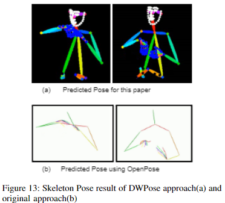
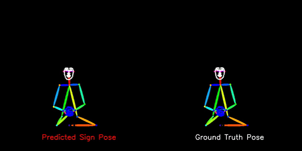
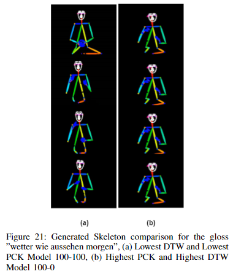
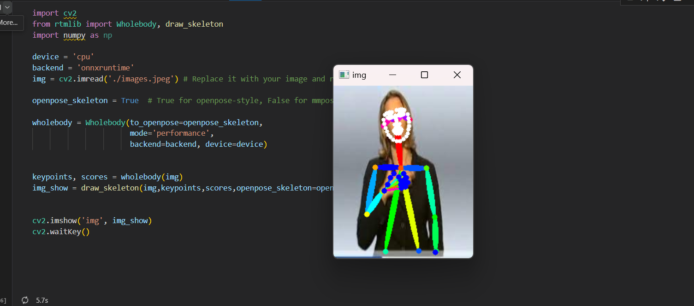

# Effectiveness of Multi-Scaling Keypoints for Sign Language Translation

## Abstract
Sign language primarily uses visual cues to communicate. However, existing sign language translation models tend to neglect facial features or rely on outdated pose estimation models. In this project, we propose a modern sign language translation model that generates facial features using a modern pose estimation method, DWPose. This paper discusses the additional complexity facial features bring and potential solutions to address these challenges. We experiment with various preprocessing techniques to enhance the model’s capability in generating sign language poses, focusing on different scaling variations to the pose keypoints. By scaling keypoints differently, the loss function contribution of all the keypoints is affected, encouraging the translation model to focus on learning certain features more than others. Through experimentation, we assess the impact of different scaling methods on the generated keypoint output. The translation model used in this work is based on the Progressive Transformer.

## Dataset
The dataset used in this project is the PHOENIX14T dataset. You can download it from the [PHOENIX14T website](https://www-i6.informatik.rwth-aachen.de/~koller/RWTH-PHOENIX-2014-T/). Due to size constraints, example data can be found in the ExampleData folder.

## Qualititave Evaluation

### Comparison with previous models
<div align="center">
  
</div>

Figure above presents the visual differences between both methods of sign language generation. Although the original approach(OpenPose) is successful in capturing a hand gesture and body shoulder movements. Our implementation with DWPose successfully produced an image with complete facial and body features. The total 2D keypoint value of the original PT contains 50 X, Y coordinate pairs, whereas compared to the DWPose approach, it captured a total of 134 X, Y coordinate pairs with 67 pairs dedicated to facial keypoints.


### Best Results
<div align="center">
  
</div>

- The figure above showcases the model's results by comparing the ground truth poses with the predicted poses.

<div align="center">
  
</div>

-Generated Skeleton comparison for the gloss ”wetter wie aussehen morgen”, (a) Lowest DTW and Lowest PCK Model 100-100, (b) Highest PCK and Highest DTW Model 100-0.


## Evaluation


### Instructions
To run the Progressive Transformer:

1. Each folder contains its own `requirements.txt` file. To run the code, all the required libraries need to be downloaded first.
2. Download the PHOENIX14T dataset.
3. Perform DWPose pose estimation by running the `dw_extract.py` file located in the DWPose_RTMB folder (or you can run the `demo.ipynb` file on a single image; an image from PHOENIX14T is also included for testing if interested).
   
4. Ensure that the skeleton poses are in a file ending with ".skels" (further instructions are in the Progressive Transformer folder).
5. Pass the skeleton ".skels" file into the `counter_embedding.py` file to perform counter embedding. Make sure to do this for each dataset.
6. Adjust the configuration file as needed. Make sure that you have `.skels`, `.file`, and `.gloss` for all training, validation, and test sets (as shown in the ExampleData folder).
7. Put all the files into the `sign_data` folder in the Progressive Transformer folder (adjust the `dw_plot_video.py` scaling value according to the normalization done to keypoints).
8. Run the `training.py` file in the Progressive Transformer folder (make sure the correct config is utilized, as noted in the #Change here# section).

- Note: `dw_plot_video.py` is important for drawing skeleton poses for DWPose. It uses code from rtmlib ([GitHub Repository](https://github.com/Tau-J/rtmlib)) and is implemented to be compatible with the transformer.


## Information about the Code
The code consists of three sections:
- **DWPose_RTMB:** This is the rtmlib from Jiang, Tao ([GitHub Repository](https://github.com/Tau-J/rtmlib)). This part of the code performs DWPose and draws the skeletal keypoints for the poses. Note that the code was also changed to make it compatible with our project.
- **Counter_embedding:** Adds counter values to the skeleton keypoints estimates (done right after pose estimation for the dataset).
- **Progressive Transformer:** An adjusted version of Ben Saunders' Progressive Transformer ([saunders2020progressive](https://arxiv.org/abs/2004.14874)) to make it DWPose compatible.


## Citations

```bibtex
@misc{rtmlib,
  title={rtmlib},
  author={Jiang, Tao},
  year={2023},
  howpublished = {\url{https://github.com/Tau-J/rtmlib}},
}

@misc{jiang2023,
  doi = {10.48550/ARXIV.2303.07399},
  url = {https://arxiv.org/abs/2303.07399},
  author = {Jiang, Tao and Lu, Peng and Zhang, Li and Ma, Ningsheng and Han, Rui and Lyu, Chengqi and Li, Yining and Chen, Kai},
  keywords = {Computer Vision and Pattern Recognition (cs.CV), FOS: Computer and information sciences, FOS: Computer and information sciences},
  title = {RTMPose: Real-Time Multi-Person Pose Estimation based on MMPose},
  publisher = {arXiv},
  year = {2023},
  copyright = {Creative Commons Attribution 4.0 International}
}

@misc{lu2023rtmo,
      title={{RTMO}: Towards High-Performance One-Stage Real-Time Multi-Person Pose Estimation},
      author={Peng Lu and Tao Jiang and Yining Li and Xiangtai Li and Kai Chen and Wenming Yang},
      year={2023},
      eprint={2312.07526},
      archivePrefix={arXiv},
      primaryClass={cs.CV}
}

@inproceedings{saunders2020progressive,
  title = {{Progressive Transformers for End-to-End Sign Language Production}},
  author = {Saunders, Ben and Camgoz, Necati Cihan and Bowden, Richard},
  booktitle = {Proceedings of the European Conference on Computer Vision (ECCV)},
  year = {2020}
}

@inproceedings{saunders2020adversarial,
  title = {{Adversarial Training for Multi-Channel Sign Language Production}},
  author = {Saunders, Ben and Camgoz, Necati Cihan and Bowden, Richard},
  booktitle = {Proceedings of the British Machine Vision Conference (BMVC)},
  year = {2020}
}

@inproceedings{saunders2021continuous,
  title = {{Continuous 3D Multi-Channel Sign Language Production via Progressive Transformers and Mixture Density Networks}},
  author = {Saunders, Ben and Camgoz, Necati Cihan and Bowden, Richard},
  booktitle = {International Journal of Computer Vision (IJCV)},
  year = {2021}
}

@misc{diss,
  author = {Gonzalez, Adam},
  title = {diss},
  howpublished = {\url{https://github.com/adamg4911/diss}},
  year = {2023},
}
